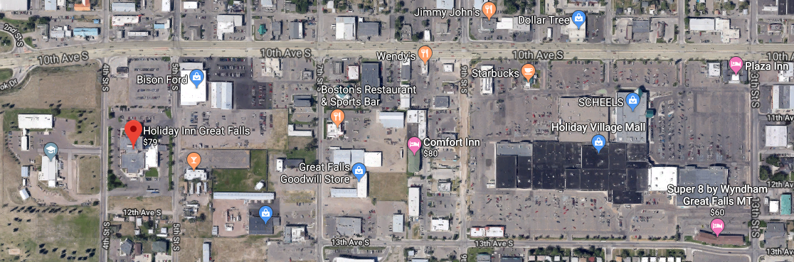
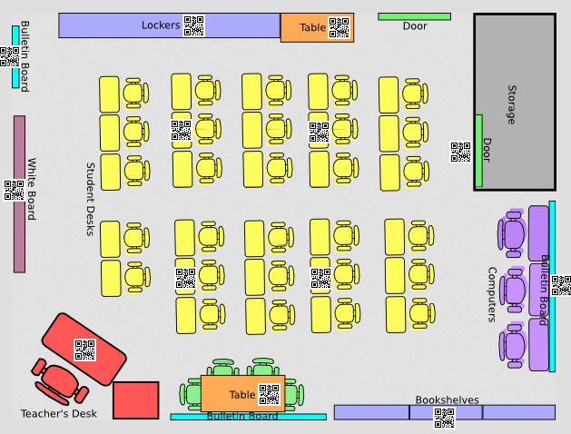

# Mobile City (Bears-Team-16)
[Mobile City](https://github.com/chingu-voyage7/Bears-Team-16) | Voyage-7 | https://chingu.io/

## Welcome
Welcome to the documentation for Mobile City!  
Mobile City is a shared-experience game platform for one to over a hundred players.  
Gameplay can be customized for murder mysteries, survival games, LARPs, and sandboxes.  
Players interact face-to-face and use their smartphones for clues, actions, and items.  
Mobile City comes with premade scenarios but you can modify them or create your own.  

  
  

## Hosting your own Event
### Requirements

For the full in-person experience:

- A large area with permission to place printed QR pages and rule pages
- A projector screen setup (optional but needed for the full experience)
- A compatible computer to use as the server or rent a cloud server
- A printer for QR pages and Character badges
- A way to attach badges (badge holder, clips, tape, safety pins, etc)
- A smartphone or tablet for each player (sub-optimally devices may be shared)
- Enough time for players to finish the story without saving
- Staff or volunteers willing to stop playing to help with any complications

For the sub-optimal online experience:

- A computer to use as the server or rent a cloud server
- A browser for each player (sub-optimally browsers may be shared)
- A mic and webcam for each player (optional but needed for a better experience)
- Enough time for players to finish the story without saving

## Server
### Requirements
- Node.js
- Wifi or Internet access to all players

### Setup
- Not yet implemented

## Customize Gameplay
- Not yet implemented

## Platform Development
- [Mobile City Development Page](PROJECT.md)  
- [Mobile City Source Code](https://github.com/chingu-voyage7/Bears-Team-16)  

## Copywrite
- Unknown  
